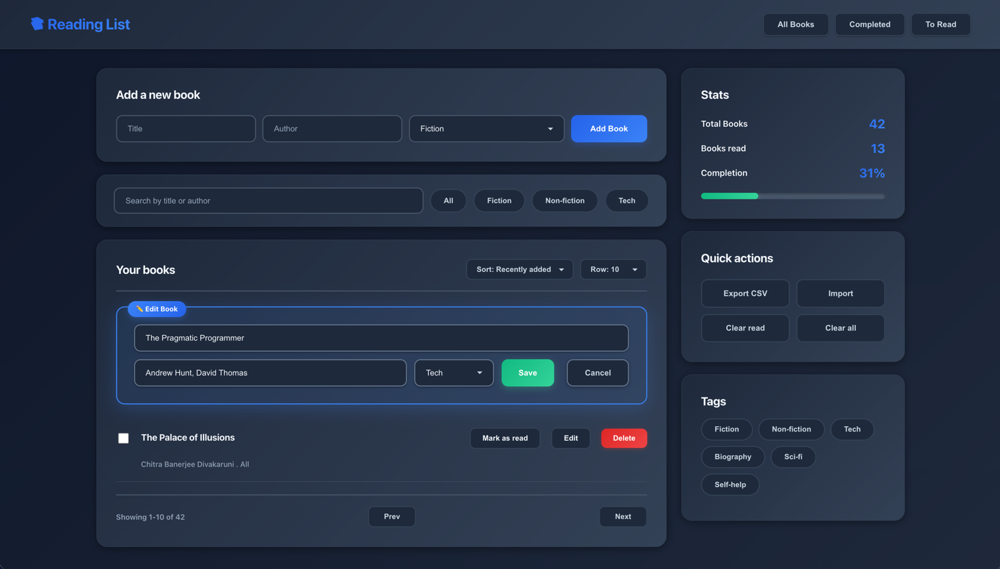

# Reading List App 📚

> **Status: Work in Progress**
>
> This is an active project I'm building to practice my full-stack development skills. The front-end UI is built, and I am currently working on the back-end API and database.




## About This Project

The Reading List App is a full-stack (PERN) application designed to help users track, categorize, and manage their personal reading lists.

## Technology Stack

This project is being built with the **PERN stack**:

* **P**ostgreSQL: Database
* **E**xpress.js: Back-end API
* **R**eact: Front-end (using Vite)
* **N**ode.js: Server runtime

### Current Status:
* **Front-End (Complete):** The React UI is built with components for adding books, filtering, and displaying stats.
* **Back-End (In Progress):** Currently developing the REST API with Express.js.
* **Database (Planned):** Schemas for PostgreSQL are being designed.

## Feature Tracker

### Completed
- Add new book (title, author, genre)
- Edit book details
- Front-end UI design (React + Vite)
- Dark mode toggle(Based on System Preference)

---

### In Progress
- Search by title or author
- Sort books (recently added)
- Pagination (Prev / Next)
- Book stats (Total, Read, Completion %)
- Tag filters (Fiction, Non-fiction, Tech)
- Delete Book
- Mark as read / unread
- Export to CSV
- Backend API (Express.js)

---

### Planned
- Import from CSV
- Clear all / Clear read buttons (functionality)
- PostgreSQL database schema
- Responsive / Mobile layout
- User authentication (optional)


## How to Run the Front-End

You can run the front-end locally to see the UI.

1.  Clone the repository:
    ```sh
    git clone [https://github.com/Soumya98-dev/reading-list-app.git](https://github.com/Soumya98-dev/reading-list-app.git)
    ```
2.  Navigate to the project directory:
    ```sh
    cd reading-list-app
    ```
3.  Install dependencies:
    ```sh
    npm install
    ```
4.  Run the development server:
    ```sh
    npm run dev
    ```